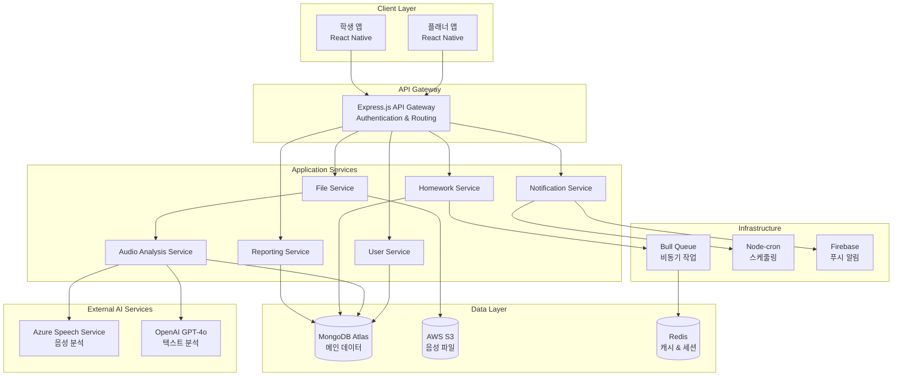

# Design Document

## Overview

앤보임 영어회화 자동화 관리 시스템은 React Native 기반 크로스 플랫폼 모바일 앱과 Node.js 백엔드로 구성된 통합 교육 관리 플랫폼입니다. 핵심 혁신은 FFmpeg를 활용한 음성 추출 최적화(90MB→5-10MB)와 Microsoft Azure Speech Service 및 OpenAI API를 통한 AI 기반 학습 분석입니다.

## Architecture

### System Architecture Diagram

```
[앤보임 관리 페이지] → [녹화 파일 다운로드(MP4, 90MB)]
                                     ↓
                         [플래너 앱 업로드] → [음성 추출(MP3, 5-10MB)]
                                     ↓
                               [중앙 서버] → [원본 파일 삭제]
                                     ↓
                           [AI 음성 분석 모듈] ←→ [학생 앱]
                                     ↓
                           [알림/스케줄링 시스템]
```

### High-Level Architecture



## Components and Interfaces

### 1. Mobile Applications (React Native)

#### 플래너 앱 주요 컴포넌트
```typescript
// 파일 업로드 컴포넌트
interface FileUploadComponent {
  uploadProgress: number;
  onFileSelect: (file: DocumentPickerResponse) => void;
  onUploadComplete: (result: AudioExtractionResult) => void;
}

// 수업 분석 대시보드
interface LessonAnalysisDashboard {
  studentMetrics: StudentAnalysisMetrics[];
  lessonInsights: LessonInsight[];
  improvementAreas: ImprovementArea[];
}

// 숙제 관리 컴포넌트
interface HomeworkManager {
  scheduleHomework: (homework: HomeworkSchedule) => void;
  generatePersonalizedHomework: (studentId: string, analysisData: AnalysisData) => void;
  bulkAssignment: (studentIds: string[], homework: Homework) => void;
}
```

#### 학생 앱 주요 컴포넌트
```typescript
// 숙제 제출 컴포넌트
interface HomeworkSubmission {
  recordAudio: () => Promise<AudioRecording>;
  submitText: (text: string) => void;
  uploadImage: (image: ImagePickerResponse) => void;
  getSubmissionStatus: () => SubmissionStatus;
}

// 진도 추적 컴포넌트
interface ProgressTracker {
  currentProgress: StudentProgress;
  achievements: Achievement[];
  upcomingDeadlines: Deadline[];
}
```

### 2. Backend Services (Node.js + Express)

#### Core Service Interfaces
```typescript
// 사용자 관리 서비스
interface UserService {
  authenticateUser(credentials: LoginCredentials): Promise<AuthResult>;
  getUserProfile(userId: string): Promise<UserProfile>;
  updateUserProfile(userId: string, updates: ProfileUpdates): Promise<void>;
}

// 파일 처리 서비스
interface FileService {
  uploadFile(file: MulterFile, metadata: FileMetadata): Promise<UploadResult>;
  extractAudio(videoFile: VideoFile): Promise<AudioFile>;
  deleteOriginalFile(fileId: string): Promise<void>;
  getFileUrl(fileId: string): Promise<string>;
}

// AI 분석 서비스
interface AudioAnalysisService {
  analyzeSpeech(audioFile: AudioFile): Promise<SpeechAnalysis>;
  separateSpeakers(audioFile: AudioFile): Promise<SpeakerSegments>;
  evaluatePronunciation(audioFile: AudioFile, targetText?: string): Promise<PronunciationScore>;
  generateLessonInsights(analysisData: SpeechAnalysis): Promise<LessonInsights>;
}

// 숙제 관리 서비스
interface HomeworkService {
  createHomework(homework: HomeworkData): Promise<Homework>;
  scheduleHomework(schedule: HomeworkSchedule): Promise<void>;
  generatePersonalizedHomework(studentId: string, analysisData: AnalysisData): Promise<Homework>;
  submitHomework(submission: HomeworkSubmission): Promise<SubmissionResult>;
  evaluateHomework(submissionId: string): Promise<EvaluationResult>;
}
```

### 3. External API Integration

#### Azure Speech Service Integration
```typescript
interface AzureSpeechService {
  speechToText(audioBuffer: Buffer): Promise<TranscriptionResult>;
  pronunciationAssessment(audioBuffer: Buffer, referenceText: string): Promise<PronunciationAssessment>;
  speakerRecognition(audioBuffer: Buffer): Promise<SpeakerIdentification>;
}
```

#### OpenAI API Integration
```typescript
interface OpenAIService {
  analyzeConversation(transcript: string): Promise<ConversationAnalysis>;
  generateHomework(studentProfile: StudentProfile, lessonContent: string): Promise<PersonalizedHomework>;
  evaluateWriting(text: string): Promise<WritingEvaluation>;
  generateFeedback(evaluationData: EvaluationData): Promise<Feedback>;
}
```

## Data Models

### Core Data Models

```typescript
// 사용자 모델
interface User {
  _id: ObjectId;
  email: string;
  password: string; // hashed
  role: 'planner' | 'student';
  profile: UserProfile;
  createdAt: Date;
  updatedAt: Date;
}

interface UserProfile {
  name: string;
  phone?: string;
  avatar?: string;
  preferences: UserPreferences;
  // 플래너 전용 필드
  managedStudents?: ObjectId[];
  // 학생 전용 필드
  assignedPlanner?: ObjectId;
  learningLevel?: string;
}

// 수업 및 분석 모델
interface Lesson {
  _id: ObjectId;
  plannerId: ObjectId;
  studentId: ObjectId;
  originalVideoFile: FileReference;
  extractedAudioFile: FileReference;
  analysisResult: LessonAnalysis;
  lessonDate: Date;
  duration: number;
  status: 'uploaded' | 'processing' | 'analyzed' | 'completed';
  createdAt: Date;
}

interface LessonAnalysis {
  speakerSegments: SpeakerSegment[];
  studentMetrics: StudentMetrics;
  pronunciationScores: PronunciationScore[];
  participationLevel: number;
  improvementAreas: string[];
  lessonInsights: string[];
  generatedNotes: string;
}

interface SpeakerSegment {
  speaker: 'teacher' | 'student';
  startTime: number;
  endTime: number;
  transcript: string;
  confidence: number;
}

interface StudentMetrics {
  speakingTime: number;
  pronunciationAccuracy: number;
  fluencyScore: number;
  vocabularyUsage: VocabularyMetric[];
  grammarAccuracy: number;
}

// 숙제 모델
interface Homework {
  _id: ObjectId;
  plannerId: ObjectId;
  studentIds: ObjectId[];
  title: string;
  description: string;
  type: 'audio' | 'text' | 'mixed';
  content: HomeworkContent;
  dueDate: Date;
  scheduledSendTime?: Date;
  isPersonalized: boolean;
  basedOnLessonId?: ObjectId;
  status: 'draft' | 'scheduled' | 'sent' | 'completed';
  createdAt: Date;
}

interface HomeworkContent {
  instructions: string;
  attachments: FileReference[];
  questions: HomeworkQuestion[];
  expectedDuration?: number;
}

interface HomeworkQuestion {
  id: string;
  type: 'audio_recording' | 'text_input' | 'multiple_choice';
  question: string;
  options?: string[];
  targetAnswer?: string;
}

// 제출 및 평가 모델
interface HomeworkSubmission {
  _id: ObjectId;
  homeworkId: ObjectId;
  studentId: ObjectId;
  answers: SubmissionAnswer[];
  submittedAt: Date;
  aiEvaluation?: AIEvaluation;
  plannerFeedback?: PlannerFeedback;
  finalScore?: number;
  status: 'submitted' | 'ai_evaluated' | 'reviewed' | 'completed';
}

interface SubmissionAnswer {
  questionId: string;
  type: 'audio' | 'text' | 'choice';
  content: string | FileReference;
  metadata?: AnswerMetadata;
}

interface AIEvaluation {
  pronunciationScore?: PronunciationAssessment;
  grammarCorrections?: GrammarCorrection[];
  vocabularyFeedback?: VocabularyFeedback;
  overallScore: number;
  strengths: string[];
  improvementAreas: string[];
  generatedAt: Date;
}
```

### Database Schema Design

```typescript
// MongoDB Collections
const collections = {
  users: 'users',
  lessons: 'lessons', 
  homework: 'homework',
  submissions: 'submissions',
  notifications: 'notifications',
  analytics: 'analytics'
};

// Indexes for Performance
const indexes = {
  users: [
    { email: 1 },
    { role: 1, 'profile.assignedPlanner': 1 }
  ],
  lessons: [
    { plannerId: 1, lessonDate: -1 },
    { studentId: 1, lessonDate: -1 },
    { status: 1, createdAt: -1 }
  ],
  homework: [
    { plannerId: 1, createdAt: -1 },
    { studentIds: 1, dueDate: 1 },
    { status: 1, scheduledSendTime: 1 }
  ],
  submissions: [
    { homeworkId: 1, studentId: 1 },
    { studentId: 1, submittedAt: -1 },
    { status: 1, submittedAt: -1 }
  ]
};
```

## Error Handling

### Error Classification and Response Strategy

```typescript
// 에러 타입 정의
enum ErrorType {
  VALIDATION_ERROR = 'VALIDATION_ERROR',
  AUTHENTICATION_ERROR = 'AUTHENTICATION_ERROR',
  AUTHORIZATION_ERROR = 'AUTHORIZATION_ERROR',
  FILE_PROCESSING_ERROR = 'FILE_PROCESSING_ERROR',
  AI_SERVICE_ERROR = 'AI_SERVICE_ERROR',
  DATABASE_ERROR = 'DATABASE_ERROR',
  EXTERNAL_API_ERROR = 'EXTERNAL_API_ERROR',
  SYSTEM_ERROR = 'SYSTEM_ERROR'
}

// 통합 에러 핸들링
interface AppError {
  type: ErrorType;
  message: string;
  code: string;
  statusCode: number;
  details?: any;
  retryable: boolean;
}

// 에러 처리 전략
const errorHandlingStrategy = {
  // 파일 처리 에러
  FILE_PROCESSING_ERROR: {
    retry: true,
    maxRetries: 3,
    fallback: 'manual_processing_queue',
    userMessage: '파일 처리 중 오류가 발생했습니다. 잠시 후 다시 시도해주세요.'
  },
  
  // AI 서비스 에러
  AI_SERVICE_ERROR: {
    retry: true,
    maxRetries: 2,
    fallback: 'basic_analysis',
    userMessage: 'AI 분석 중 오류가 발생했습니다. 기본 분석으로 진행됩니다.'
  },
  
  // 외부 API 에러
  EXTERNAL_API_ERROR: {
    retry: true,
    maxRetries: 3,
    exponentialBackoff: true,
    fallback: 'cached_response',
    userMessage: '외부 서비스 연결 오류입니다. 잠시 후 다시 시도해주세요.'
  }
};
```

### Circuit Breaker Pattern for External Services

```typescript
interface CircuitBreakerConfig {
  failureThreshold: number;
  resetTimeout: number;
  monitoringPeriod: number;
}

const circuitBreakerConfigs = {
  azureSpeechService: {
    failureThreshold: 5,
    resetTimeout: 60000, // 1분
    monitoringPeriod: 300000 // 5분
  },
  openaiService: {
    failureThreshold: 3,
    resetTimeout: 120000, // 2분
    monitoringPeriod: 600000 // 10분
  }
};
```

## Testing Strategy

### Testing Pyramid

```typescript
// 1. Unit Tests (70%)
const unitTestAreas = [
  'Service layer business logic',
  'Data model validation',
  'Utility functions',
  'API request/response formatting',
  'Audio processing algorithms'
];

// 2. Integration Tests (20%)
const integrationTestAreas = [
  'Database operations',
  'External API integrations (Azure, OpenAI)',
  'File upload and processing pipeline',
  'Authentication and authorization flows',
  'Push notification delivery'
];

// 3. End-to-End Tests (10%)
const e2eTestScenarios = [
  'Complete lesson upload and analysis workflow',
  'Homework creation, assignment, and submission cycle',
  'Student progress tracking and reporting',
  'Multi-user collaboration scenarios'
];
```

### Test Data Management

```typescript
// 테스트 데이터 전략
interface TestDataStrategy {
  // 실제 음성 파일 샘플 (다양한 품질, 길이)
  audioSamples: {
    highQuality: string[];
    lowQuality: string[];
    shortDuration: string[];
    longDuration: string[];
    multiSpeaker: string[];
  };
  
  // 모의 AI 응답
  mockAIResponses: {
    azureSpeechService: MockResponse[];
    openaiService: MockResponse[];
  };
  
  // 테스트 사용자 데이터
  testUsers: {
    planners: TestUser[];
    students: TestUser[];
  };
}
```

### Performance Testing

```typescript
// 성능 테스트 기준
const performanceTargets = {
  // API 응답 시간
  apiResponseTime: {
    p95: 500, // ms
    p99: 1000 // ms
  },
  
  // 파일 처리 시간
  fileProcessing: {
    audioExtraction: 30, // seconds for 90MB file
    aiAnalysis: 60 // seconds for 10MB audio
  },
  
  // 동시 사용자 처리
  concurrentUsers: {
    target: 100,
    maximum: 500
  },
  
  // 메모리 사용량
  memoryUsage: {
    baseline: '512MB',
    peak: '1GB'
  }
};
```

### Automated Testing Pipeline

```typescript
// CI/CD 테스트 파이프라인
const testingPipeline = {
  stages: [
    {
      name: 'lint_and_format',
      tools: ['ESLint', 'Prettier'],
      failFast: true
    },
    {
      name: 'unit_tests',
      tools: ['Jest'],
      coverage: { minimum: 80 },
      parallel: true
    },
    {
      name: 'integration_tests',
      tools: ['Jest', 'Supertest'],
      environment: 'test',
      dependencies: ['MongoDB', 'Redis']
    },
    {
      name: 'e2e_tests',
      tools: ['Detox', 'Appium'],
      environment: 'staging',
      devices: ['iOS Simulator', 'Android Emulator']
    },
    {
      name: 'performance_tests',
      tools: ['Artillery', 'Lighthouse'],
      environment: 'staging',
      thresholds: performanceTargets
    }
  ]
};
```

### Security Testing

```typescript
// 보안 테스트 영역
const securityTestAreas = [
  'Authentication bypass attempts',
  'Authorization privilege escalation',
  'File upload security (malicious files)',
  'API input validation and sanitization',
  'Data encryption in transit and at rest',
  'Rate limiting and DDoS protection',
  'Sensitive data exposure in logs',
  'Third-party dependency vulnerabilities'
];
```

이 설계 문서는 1인 개발 환경에서 Kiro AI를 활용하여 효율적으로 구현할 수 있도록 최적화되었으며, 음성 추출 중심의 비용 효율적 아키텍처와 확장 가능한 모듈 구조를 제공합니다.