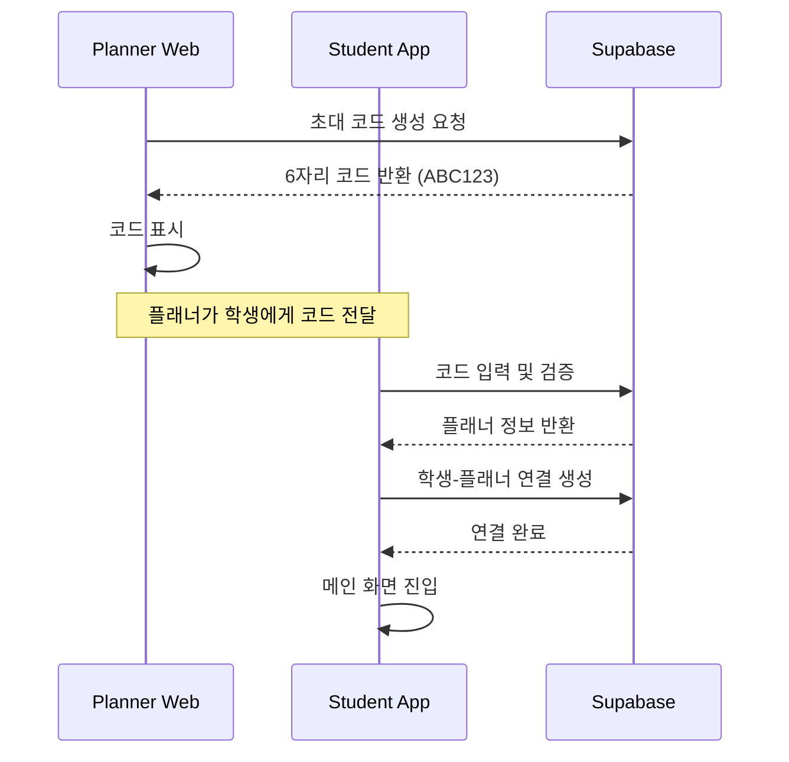

# NVOIM Planner Pro - 비즈니스 모델 및 시스템 아키텍처

## 📊 비즈니스 모델

### 1. 수익 구조
- **운영자 (시스템 제공자)**: SaaS 형태로 플래너들에게 월 구독료 징수
- **플래너 (강사)**: 구독료 지불 → 학생 관리 자동화 → 시간 절약 → 더 많은 학생 관리 가능
- **학생**: 플래너가 제공하는 영어 학습 서비스 이용

### 2. 핵심 가치 제안 (Value Proposition)
#### 플래너를 위한 가치
- ⏰ **시간 절약**: 수동 관리 작업을 자동화하여 관리 시간 80% 감소
- 📈 **수익 증대**: 같은 시간에 더 많은 학생 관리 가능
- 🤖 **AI 자동화**: 
  - 자동 발음 평가 및 피드백
  - 학습 진도 자동 분석
  - 개인화된 학습 자료 추천
- 📱 **통합 관리**: 웹앱 하나로 모든 학생 관리

## 🏗️ 시스템 아키텍처

### 1. Multi-Tenant 구조
```
NVOIM Platform (운영자)
    ├── Planner A (구독자)
    │   ├── API Keys (자체 부담)
    │   │   ├── OpenAI API Key
    │   │   └── Azure Speech API Key
    │   └── Students (20-50명)
    │       ├── Student 1
    │       ├── Student 2
    │       └── ...
    │
    ├── Planner B (구독자)
    │   ├── API Keys (자체 부담)
    │   └── Students (30-60명)
    │
    └── Planner C (구독자)
        ├── API Keys (자체 부담)
        └── Students (40-70명)
```

### 2. 연결 프로세스 (Invite Code System)



### 3. API 키 관리 시스템

#### 현재 문제점
- 시스템 운영자의 API 키를 모든 플래너가 공유 → 막대한 API 비용

#### 해결 방안
```typescript
// 각 플래너별 API 키 저장 구조
interface PlannerAPIKeys {
  planner_id: string;
  openai_api_key: string;      // 암호화 저장
  azure_speech_key: string;     // 암호화 저장
  azure_region: string;
  is_active: boolean;
  created_at: Date;
  updated_at: Date;
}
```

## 💼 구독 플랜 구조

### Basic Plan (₩29,000/월)
- 학생 관리: 최대 20명
- 기본 AI 피드백
- 월간 리포트
- 이메일 지원

### Professional Plan (₩49,000/월)
- 학생 관리: 최대 50명
- 고급 AI 피드백
- 실시간 분석
- 주간/월간 리포트
- 우선 지원

### Enterprise Plan (₩99,000/월)
- 학생 관리: 무제한
- 프리미엄 AI 기능
- 커스텀 브랜딩
- API 접근
- 전담 지원

## 🔄 핵심 워크플로우

### 1. 플래너 온보딩
1. 플래너 회원가입 → 무료 체험 시작 (7일)
2. API 키 설정 페이지 안내
3. OpenAI, Azure 계정 생성 가이드 제공
4. API 키 입력 및 검증
5. 초대 코드 생성
6. 학생들에게 코드 배포

### 2. 일일 운영 플로우
```
플래너 로그인
    ↓
대시보드 확인 (오늘의 수업, 숙제 현황)
    ↓
숙제 생성 및 배정 (자동 알림)
    ↓
학생 제출물 자동 수집
    ↓
AI 자동 분석 및 피드백
    ↓
플래너 검토 및 추가 피드백
    ↓
학생에게 최종 피드백 전송
```

### 3. 학생 학습 플로우
```
앱 로그인
    ↓
오늘의 숙제 확인
    ↓
음성 녹음 및 제출
    ↓
AI 즉시 피드백 수신
    ↓
학습 자료 학습
    ↓
진도 확인
```

## 🎯 개발 우선순위

### Phase 1: 핵심 인프라 (완료)
- ✅ 기본 앱 구조
- ✅ Supabase 연동
- ✅ 인증 시스템

### Phase 2: API 키 관리 시스템 (진행중)
- [ ] API 키 입력 UI
- [ ] API 키 암호화 저장
- [ ] API 키 검증 시스템
- [ ] Edge Function 수정 (플래너별 API 키 사용)

### Phase 3: 초대 코드 시스템
- [ ] 코드 생성 로직
- [ ] 코드 검증 시스템
- [ ] 학생-플래너 연결 플로우

### Phase 4: 구독 및 결제
- [ ] 구독 플랜 관리
- [ ] 결제 시스템 연동 (Tosspayments)
- [ ] 사용량 제한 및 모니터링

### Phase 5: 고급 기능
- [ ] 고급 분석 대시보드
- [ ] 자동화 규칙 설정
- [ ] 커스텀 리포트
- [ ] 화이트 라벨링

## 📈 성공 지표 (KPIs)

### 운영자 관점
- MAU (월간 활성 플래너 수)
- MRR (월간 반복 수익)
- Churn Rate (이탈률)
- LTV (고객 생애 가치)

### 플래너 관점
- 학생 관리 시간 감소율
- 학생당 평균 수익 증가율
- AI 피드백 활용률
- 학생 만족도

### 학생 관점
- 앱 사용률
- 숙제 제출률
- 학습 진도율
- 실력 향상도

## 🔐 보안 및 규정 준수

### 데이터 보안
- API 키 암호화 (AES-256)
- RLS (Row Level Security) 적용
- HTTPS 전용 통신
- 정기 보안 감사

### 개인정보 보호
- GDPR/KISA 준수
- 최소 데이터 수집 원칙
- 데이터 격리 (플래너간)
- 정기 데이터 삭제

## 💡 차별화 전략

### 1. 비용 효율성
- 플래너가 자체 API 키 사용 → 투명한 비용 구조
- 사용한 만큼만 지불 (API 비용)
- 저렴한 구독료

### 2. 자동화 수준
- 90% 이상 자동화된 학생 관리
- AI 기반 개인화 피드백
- 실시간 진도 추적

### 3. 확장성
- 학생 수 증가에 따른 선형적 관리 부담
- 플래너당 100명 이상 관리 가능
- 다국어 지원 준비

---

*마지막 업데이트: 2026-01-05*